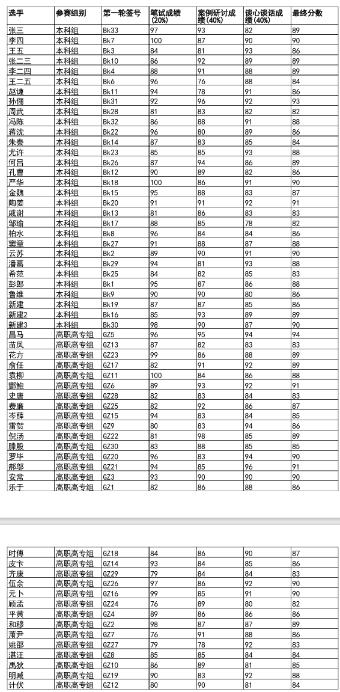

# README

### 项目介绍

该项目是重庆市第十一届辅导员素质评比大赛系统，目前只有后端部分，基于Springboot+Mybatis-plus+Sa-Token实现，整合rabbitMq失败，后续有时间会加上。后端部分主要包括账号注册，权限管理，账号登陆，辅导员报名，笔试抽签，案例研讨抽签，笔试打分，案例研讨打分，情景演绎打分，成绩导出等接口实现。

### 项目演示

##### 接口文档地址:https://console-docs.apipost.cn/preview/fd8eb63d697fea25/8c500297a2229788

##### PDF文档实例：

### 项目难点

1.对于接口的设计方面，需要尽可能地进行解耦，提高维护性

2.对于各个框架以及技术的综合应用方面，要整合各个部分，正确使用技术板块。

3.Sa-Token如何给予用户权限方面进行了很长时间的查找。

4.使用aop实现了拦截所有的方法，并在切面中进行时间记录，同时尝试使用AOP进行权限管理

### 项目亮点

1.对于Sa-Token框架的使用，类似登录认证，注解鉴权。

2.对于接口的设计还比较合理，两个赛区进行分开，防止重合

3.使用 Redis 作为二级缓存，提高数据库查询性能。当查询数据时，先从 Redis 中查找，如果缓存中存在，则直接返回结果，减少对数据库的访问。